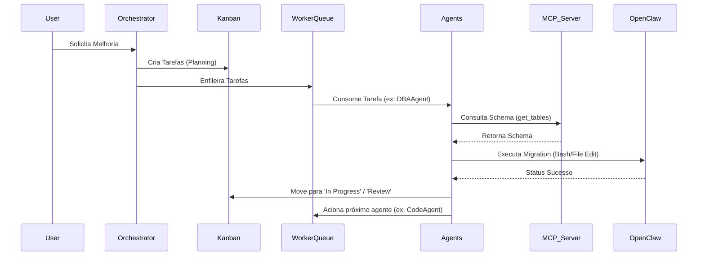

# AUTONOMOUS AI CODE FACTORY - Architecture Document

## 1. Visão Geral da Arquitetura em Camadas

O sistema foi desenhado para ser uma fábrica de software altamente distribuída, baseada em eventos e focada em isolamento de responsabilidades.

*   **Camada 1 - Orquestrador (Python)**: O cérebro do sistema. Recebe o webhook ou requisição do usuário, analisa usando um LLM de planejamento, quebra a melhoria em cards do Kanban e despacha eventos para a Worker Queue.
*   **Camada 2 - Agentes Autônomos**: Um "enxame" de agentes especializados (CodeAgent, RefactorAgent, DBAAgent, TestAgent, GitAgent, DocAgent). Eles reagem às tarefas da fila, planejam a execução e decidem quais ferramentas usar. **Eles não executam código localmente.**
*   **Camada 3 - Skills Dinâmicas**: Módulos carregados em tempo de execução. Fornecem aos agentes a "receita" de como resolver problemas específicos (ex: `analyze_schema`).
*   **Camada 4 - MCP Server (Data Knowledge)**: Um servidor dedicado ao PostgreSQL. Ele implementa o Model Context Protocol para expor o esquema do banco, triggers e constraints como ferramentas semânticas para os agentes de IA.
*   **Camada 5 - OpenClaw Executor**: O "músculo" do sistema. Um ambiente sandboxed onde as decisões dos agentes se tornam realidade (edição de arquivos, comandos de terminal, builds do docker, git).
*   **Camada 6 - Versionamento Git**: Gerenciado pelo GitAgent através do OpenClaw, automatizando o fluxo `Branch -> Commit -> PR`.
*   **Camada 7 - Kanban**: A interface humana (Human-in-the-loop). Onde o usuário aprova o andamento e o PR final.
*   **Camada 8 - Base de Conhecimento (pgvector)**: Memória de longo prazo (RAG) para contexto de código e documentação.

---

## 2. Diagrama de Fluxo



---

## 3. Estrutura do Repositório

```text
/home/j74_info/code_factory
├── orchestrator/           # API de entrada e decomposição de tarefas
├── agents/                 # Lógica dos agentes autônomos
│   ├── skills/             # Módulos injetáveis de habilidades
│   └── core/               # Classes base e prompts
├── mcp-server/             # Conector do banco de dados para os agentes
├── openclaw/               # Configurações do ambiente de execução
├── services/               # Serviços auxiliares e integrações externas
├── docker/                 # Imagens e Dockerfiles específicos
├── kanban/                 # Configuração da interface de gestão
├── database/               # Scripts SQL e inicialização do pgvector
├── docs/                   # Documentação do sistema
└── docker-compose.yml      # Infraestrutura completa
```

---

## 9. Fluxo de Geração de Código

1. **Recepção**: O usuário pede "Criar endpoint de deleção de usuários com soft-delete".
2. **Planejamento**: O Orquestrador divide: Tarefa 1 (DB), Tarefa 2 (API), Tarefa 3 (Testes). Branch `feature/user-soft-delete` é criada via OpenClaw.
3. **Banco (DBAAgent)**: Pergunta ao MCP Server sobre a tabela `users`. Gera migration. Pede ao OpenClaw para rodar a migration.
4. **Código (CodeAgent)**: Lê o contexto atualizado (RAG), gera a função em Python. Envia comando de `write_file` ao OpenClaw.
5. **Testes (TestAgent)**: Analisa o arquivo gerado, cria o `test_users.py`, pede ao OpenClaw para rodar `pytest`.
6. **Revisão**: O GitAgent commita as mudanças, abre o PR. O card no Kanban vai para `Review`. O usuário aprova e o merge é feito.